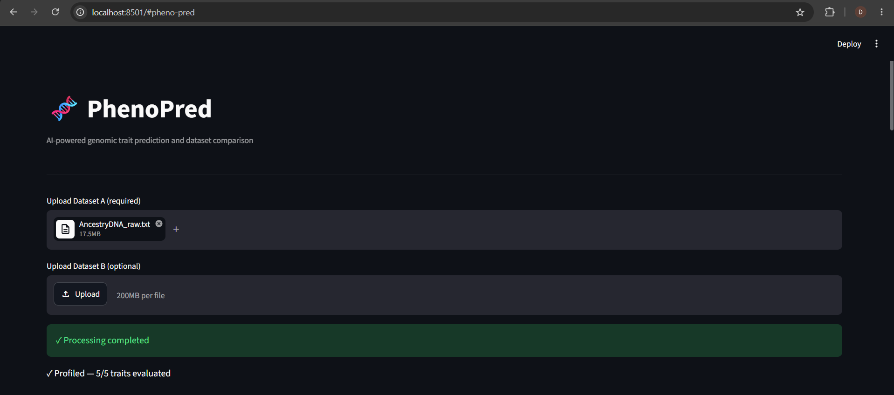
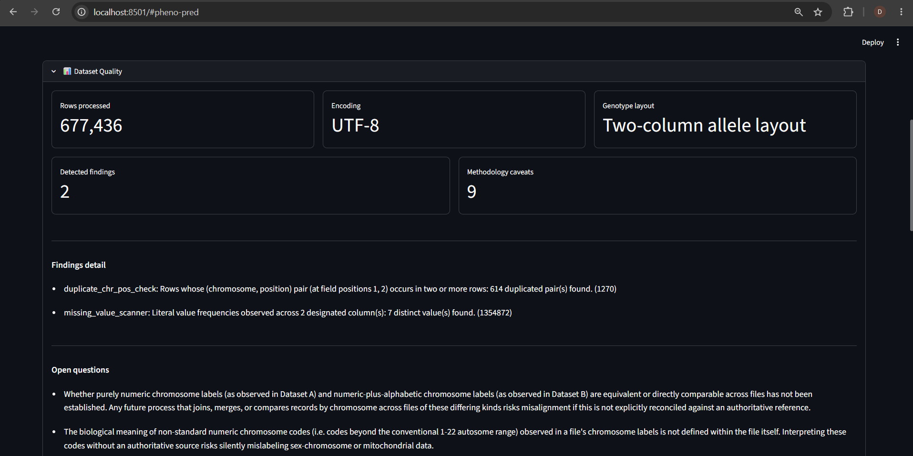
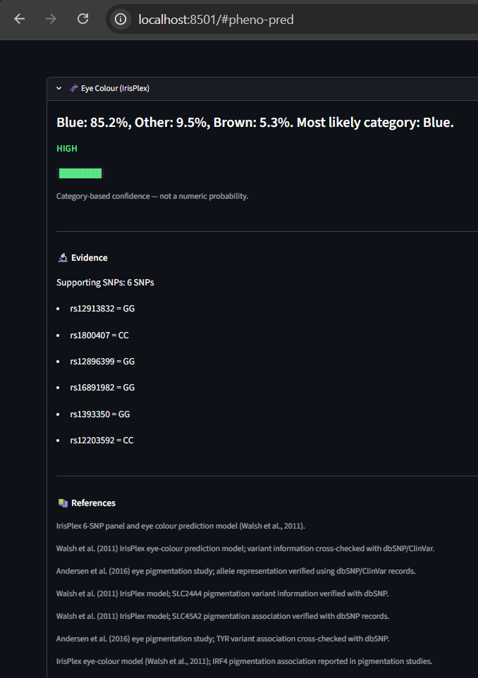
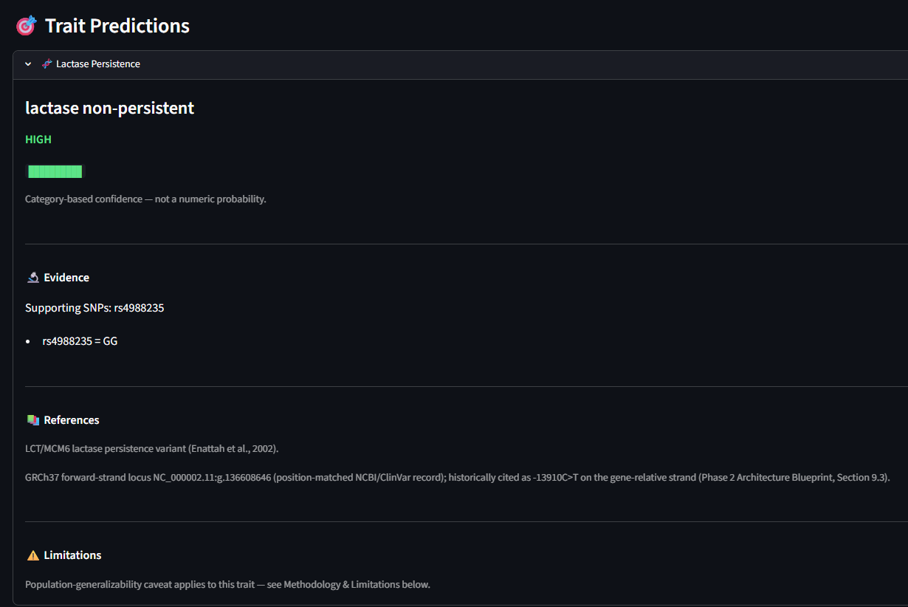
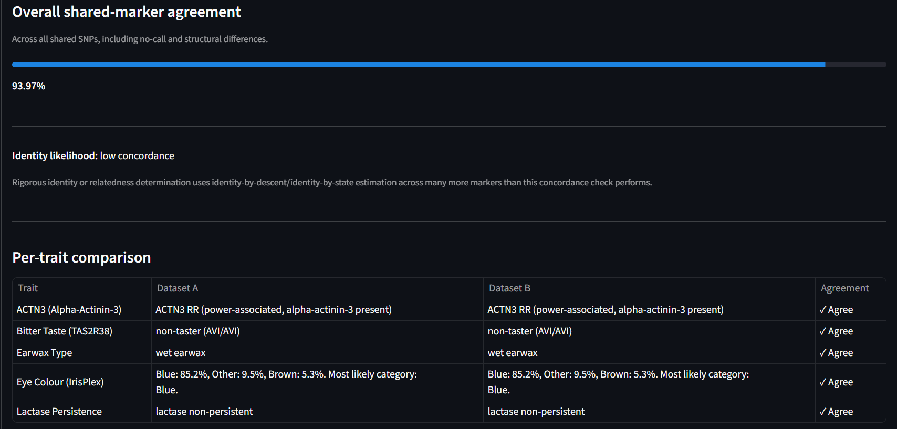
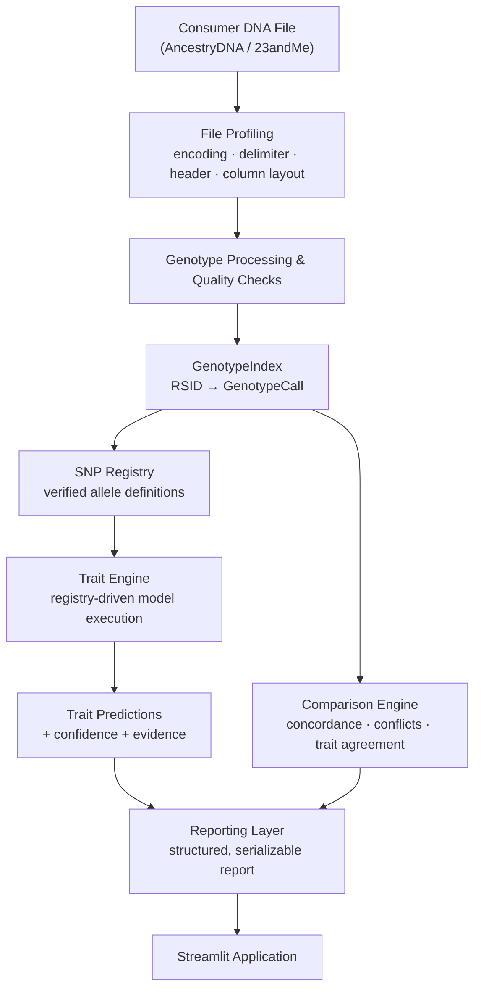

# PhenoPred

**PhenoPred** is an end-to-end genomic analytics pipeline that transforms raw, heterogeneous consumer DNA export files (AncestryDNA, 23andMe) into validated, interpretable, and explainable phenotype insights. The project was built around a deliberately narrow but important premise: genomic trait prediction is scientifically straightforward once the underlying data is clean, well-typed, and traceable — but almost every hobby-scale "DNA trait predictor" skips that part entirely. PhenoPred does not. It is a layered software system — file profiling and format detection, genotype normalization, a centralized and citation-backed SNP registry, a registry-driven trait prediction engine, a cross-dataset concordance and comparison engine, structured reporting, and an interactive Streamlit application — built with the explicit engineering discipline of a production system, not a notebook script. Every prediction the system produces is either backed by sufficient genetic evidence and clearly attributed to its scientific source, or the system says so and declines to guess. This project was developed as an MSc Applied Data Science & AI thesis project, and its primary contribution is not any single trait model — it is the reproducible, responsible pipeline architecture around it.

---

## Screenshots











---

## Features

- **Consumer DNA file support** — ingests raw AncestryDNA and 23andMe genotype exports, including both two-column-allele and single-combined-genotype file layouts, without manual configuration.
- **Automated data profiling** — detects file encoding, delimiter, header form, and column layout directly from the raw file, and surfaces data-quality findings and open methodological questions rather than silently accepting malformed input.
- **Standardized genotype representation (`GenotypeIndex`)** — normalizes every supported file format into one consistent, per-RSID genotype lookup, correctly classifying SNP, no-call, indel, haploid, and unrecognized genotype states.
- **Centralized SNP Registry** — a closed, static, citation-backed table of verified reference/alternate alleles and phenotype associations (dbSNP, ClinVar, and peer-reviewed sources), used by every trait model instead of scattered hardcoded assumptions.
- **Registry-driven Trait Engine** — resolves and executes each registered trait's model against a file's genotype data; adding a new trait requires a new model and registry entry, never a change to the orchestration logic itself.
- **Five implemented trait models** — lactase persistence, earwax type, ACTN3 (athletic performance genotype), bitter taste perception (TAS2R38), and eye colour.
- **IrisPlex eye-colour prediction** — a real, fitted six-SNP multinomial logistic regression (Walsh et al., 2011), producing calibrated Blue / Other / Brown probabilities rather than a single deterministic label.
- **Responsible uncertainty handling** — every trait model requires its full, defined set of SNPs and refuses to produce a prediction from partial evidence, returning an explicit `INSUFFICIENT_DATA` result instead of guessing.
- **Dataset comparison engine** — compares two genotype files and distinguishes genuine genotype conflicts from missing platform coverage, alongside trait-level agreement analysis.
- **Structured report generation** — assembles profiling, trait, and comparison results into a single serializable report, downloadable as JSON.
- **Interactive Streamlit application** — a working, demo-ready interface for uploading files, reviewing data-quality metrics, exploring trait predictions with evidence and confidence, and comparing two datasets.

---

## System Architecture

PhenoPred is organized as two layered subsystems: a frozen ingestion and profiling core (**Architecture V1**), and an additive prediction, comparison, and presentation layer built on top of it (**Phase 2**). Phase 2 never modifies V1 — it consumes V1's already-resolved output through a single, narrow integration point.



**Module summary:**

| Layer | Responsibility |
|---|---|
| **Ingestion & Profiling (V1)** | Reads raw files, detects encoding/delimiter/header/column layout, runs data-quality checks, and produces structured, already-parsed rows and column metadata. Frozen — never modified by Phase 2. |
| **GenotypeIndex** | The sole adapter between V1's output and Phase 2. Builds a per-file RSID → genotype lookup from V1's parsed rows, classifying each observation as a SNP call, no-call, indel, haploid, or unrecognized value. |
| **SNP Registry** | A closed, static, citation-backed table of reference/alternate alleles and phenotype-associated alleles for every SNP used by any trait model. |
| **Trait Registry & Trait Engine** | Declarative metadata for each trait (required SNPs, evidence references) paired with a registry-driven engine that resolves and executes each trait's model, independent of any specific model implementation. |
| **Trait Models** | One independent class per trait, each consulting only the SNP Registry and its own genotype input, never another trait or the file system. |
| **Comparison Engine** | Computes genome-wide concordance between two files, classifies mismatches (genuine conflict vs. missing platform coverage vs. no-call), and derives trait-level agreement. |
| **Reporting** | Assembles profiling, trait, and comparison output into one combined report and serializes it to JSON. |
| **Streamlit Application** | The user-facing interface — upload, profile, predict, compare, and download — built entirely on top of the layers above, with no prediction or comparison logic of its own. |

---

## Supported Traits

| Trait | Prediction Method | Required SNPs | Scientific Basis |
|---|---|---|---|
| Lactase Persistence | Single-SNP dominant-genotype interpretation | rs4988235 | One of the most replicated single-SNP trait associations in human genetics |
| Earwax Type | Single-SNP dominant-genotype interpretation | rs17822931 | Yoshiura et al., 2006 |
| ACTN3 (Athletic Genotype) | Three-category genotype interpretation (RR / RX / XX) | rs1815739 | R577X polymorphism; genotype is one contributory factor among many, not determinative |
| Bitter Taste Perception (TAS2R38) | Diplotype interpretation (PAV / AVI haplotypes) | rs713598, rs1726866, rs10246939 | TAS2R38 PAV (taster) / AVI (non-taster) haplotype model |
| Eye Colour | Six-SNP multinomial logistic regression (IrisPlex) | rs12913832, rs1800407, rs12896399, rs16891982, rs1393350, rs12203592 | Walsh et al., 2011 ("IrisPlex") |

Four of the five traits report a categorical confidence level (`HIGH` / `MODERATE` / `LOW`) rather than a numeric probability, since a calibrated percentage requires a model actually fitted for that purpose — one does not exist in the literature for these traits, so PhenoPred provides an evidence-based genotype interpretation instead of a manufactured number. Eye colour is the exception: IrisPlex is a genuinely fitted regression, so its output is a real three-way probability distribution. Its coefficient table is a secondary academic reproduction (see [Scientific References](#scientific-references)), cross-validated against independent sources but not digit-for-digit verified against the original publication — this is disclosed directly in the application, not hidden.

Every trait model requires its full set of SNPs. If any required SNP is missing, unreadable, or genotyped in an unrecognized format, the model returns `INSUFFICIENT_DATA` rather than predicting from a partial subset.

---

## Technology Stack

- **Python** — core pipeline, domain logic, and application code
- **Streamlit** — interactive web application layer
- **pytest** — unit and integration testing, including fake-based isolated component tests and real-file end-to-end pipeline tests
- **Object-Oriented & Protocol-based design** — structural interfaces (`Protocol`) over inheritance; composition over modification
- **Immutable data modeling** — frozen, slotted dataclasses (`@dataclass(frozen=True, slots=True)`) throughout the domain layer
- **Modular, layered software architecture** — Clean/Hexagonal-inspired separation between ingestion, domain logic, application orchestration, and presentation
- **Data engineering practices** — format detection, schema normalization, data-quality validation, and structured serialization
- **Consumer genomics domain knowledge** — dbSNP, ClinVar, and peer-reviewed literature used as primary sourcing for every genetic reference value

---

## Repository Structure

```text
phenopred/                        # Architecture V1 — ingestion, profiling, quality checks (frozen)
├── domain/                       # Entities, value objects, quality-check and profiler interfaces
├── application/                  # ProfileFileUseCase, composition root
└── infrastructure/               # File I/O, report serialization

phenopred_phase2/                 # Phase 2 — prediction, comparison, reporting, application
├── traits/
│   ├── domain/
│   │   ├── entities.py           # GenotypeCall, TraitPrediction, TraitCard, ConfidenceLevel, ...
│   │   ├── snp_registry.py       # Closed, static, citation-backed SNP reference table
│   │   ├── irisplex_coefficients.py # IrisPlex regression coefficient table
│   │   ├── trait_registry.py     # Declarative TraitDefinition entries
│   │   ├── genotype_index.py     # RSID → GenotypeCall adapter over V1 output
│   │   └── models/               # One independent TraitModel per trait
│   └── application/              # TraitEngine, trait pipeline composition
├── comparison/
│   ├── domain/                   # Concordance calculator, identity heuristic, trait diff
│   └── application/              # Comparison Engine orchestration
├── reporting/                    # PhenoPredReport, report builder, JSON serializer
├── webapp/                       # Streamlit application and its composition layer
└── tests/                        # Unit tests (per component) and integration tests (real files)

```
---

## Workflow

1. **Upload** — a user uploads one or two raw consumer DNA export files through the Streamlit application.
2. **Profile** — the file is parsed and profiled: encoding, delimiter, header form, and genotype column layout are detected automatically, and data-quality findings are recorded.
3. **Normalize** — the parsed rows are converted into a `GenotypeIndex`, a consistent per-RSID genotype lookup independent of the original file's platform or layout.
4. **Predict** — the Trait Engine resolves every registered trait against the `GenotypeIndex`, producing a `TraitPrediction` per trait: either a result with confidence and full SNP-level evidence, or an explicit `INSUFFICIENT_DATA` status.
5. **Compare** *(optional, two files)* — the Comparison Engine computes genome-wide concordance and per-trait agreement between the two datasets.
6. **Report** — all profiling, trait, and comparison output is assembled into one structured `PhenoPredReport` and serialized to JSON.
7. **Review** — the Streamlit interface presents quality metrics, individual trait cards with evidence and citations, a trait summary table, and (for two files) a full comparison dashboard, with the report available for download.

---

## Design Decisions

**Layered, composition-over-modification architecture.** Architecture V1 (ingestion and profiling) is frozen and never edited; every later capability is added as a new, sibling package that consumes V1's output through one narrow adapter (`GenotypeIndex`). This keeps the ingestion layer stable while the prediction and comparison layers evolved independently.

**Separation of concerns via Protocol-based interfaces.** Trait models, quality checks, and profilers all satisfy structural `Protocol` contracts rather than a shared base class. A model that changes its internal scoring logic — as the eye-colour model did when it was migrated from a heuristic rule to a fitted regression — requires no change anywhere else in the system.

**Immutable, closed registries as the single source of truth.** The SNP Registry and IrisPlex coefficient table are static, frozen data structures with their own citations and structural validation, consulted by trait models rather than duplicated into them. Every allele-orientation correction made during development (for example, resolving a minus-strand gene convention error) was made in exactly one place.

**A standardized internal genotype representation.** `GenotypeIndex` exists specifically so that no trait model, comparison calculator, or report ever needs to know which consumer platform a file originated from, or whether it used a two-column or single-column genotype layout.

**Responsible uncertainty handling as a first-class design constraint, not an afterthought.** Every trait model requires its complete, defined set of SNPs and returns `INSUFFICIENT_DATA` rather than a lower-confidence guess when evidence is incomplete — partial-input regression is treated as a correctness bug, not a graceful degradation. This was validated directly against two real AncestryDNA exports: one contains all six SNPs IrisPlex requires and produces a full probability output; the other is missing two of the six SNPs and correctly returns `INSUFFICIENT_DATA`, traced to the exact missing markers rather than silently degrading.

**Evidence-based interpretation over manufactured confidence.** Where no fitted, published model exists for a trait, PhenoPred reports a categorical, literature-cited interpretation instead of inventing a numeric probability it cannot support.

**Explainability by construction.** Every `TraitPrediction` carries the observed genotype and the specific SNP records it relied on, so every prediction the application shows is traceable back to a specific genotype and a specific citation, not a black-box output.

---

## Limitations

- This is **educational and research software**, developed as an MSc thesis project. It is **not validated, certified, or intended for medical, clinical, or diagnostic use**.
- Trait coverage is limited to five traits with genuinely available, published genetic models; it is not a general-purpose phenotyping platform.
- Predictions are only as strong as the published models they rely on — several traits use well-established but simplified single- or multi-SNP interpretation rules rather than fitted statistical models.
- Genetic association evidence for every trait was established primarily in cohorts of European ancestry and may not generalize equally across all populations.
- The IrisPlex eye-colour coefficient table is a secondary academic reproduction, cross-validated against independent sources but not independently verified against the original publication's own table.
- Consumer DNA array exports vary in SNP coverage between platforms and chip versions; a file that lacks a required marker will correctly, and unavoidably, produce `INSUFFICIENT_DATA` for that trait.
- The system supports the two consumer file layouts observed in AncestryDNA and 23andMe exports; other formats are not currently handled.

---

## Future Work

- Independent, primary-source verification of the IrisPlex coefficient table.
- Additional traits, as suitable published, peer-reviewed models become available.
- Broader ancestry representation in underlying trait-association evidence.
- Support for additional consumer DNA export formats and genome builds.
- Expanded automated data-quality diagnostics for consumer file edge cases.

---

## Installation

```bash
# Clone the repository
git clone https://github.com/DhyanMedappa/phenopred
cd phenopred

# Create and activate a virtual environment
python3 -m venv venv
source venv/bin/activate      # Windows: venv\Scripts\activate

# Install dependencies
pip install -r requirements.txt

# Launch the Streamlit application
streamlit run phenopred_phase2/webapp/app.py
```

Requires **Python 3.10+** (the domain layer uses slotted frozen dataclasses, which require 3.10 or later).

---

## Repository Highlights

From a software engineering perspective, PhenoPred is deliberately structured to demonstrate more than trait prediction:

- A **frozen, unmodified ingestion core** with every later feature built additively on top of it, demonstrating disciplined dependency direction over the life of the project.
- A **registry-driven execution engine** (`TraitEngine`) that is completely unaware of any concrete trait model, satisfying an open/closed extensibility requirement in practice, not just in theory.
- **Structural typing via `Protocol`** used consistently in place of inheritance, keeping every component's real dependency surface explicit and minimal.
- A **documented, evidence-driven data-correction history** — SNP allele-orientation errors identified and fixed through direct primary-source verification (dbSNP, ClinVar) rather than left as silent assumptions.
- A **test suite combining isolated unit tests (fake-based, no mocking of domain components) with real-file integration tests**, exercising the complete pipeline against genuine AncestryDNA and 23andMe exports.
- A **responsible-AI case study with real evidence**, not a hypothetical: two authentic consumer DNA files, one producing a prediction and one correctly refusing to, traced to the exact missing SNPs.

---

## Scientific References

- Walsh, S., Liu, F., Ballantyne, K.N., van Oven, M., Lao, O., Kayser, M. (2011). *IrisPlex: A sensitive DNA tool for accurate prediction of blue and brown eye colour in the absence of ancestry information.* Forensic Science International: Genetics, 5(3), 170–180.
- Yoshiura, K. et al. (2006). *A SNP in the ABCC11 gene is the determinant of human earwax type.* Nature Genetics.
- dbSNP (National Center for Biotechnology Information) — reference/alternate allele and genomic position verification.
- ClinVar (National Center for Biotechnology Information) — variant-phenotype association verification.
- Additional peer-reviewed literature underlying lactase persistence, ACTN3 (R577X), and TAS2R38 (PAV/AVI) trait associations, cited individually within the application's own evidence output for each prediction.

---

## License

*Copyright 2026 DhyanMedappa. All Rights Reserved. This code is provided for viewing purposes only. No use, copying, modification, or distribution is permitted without explicit written permission from DhyanMedappa.*